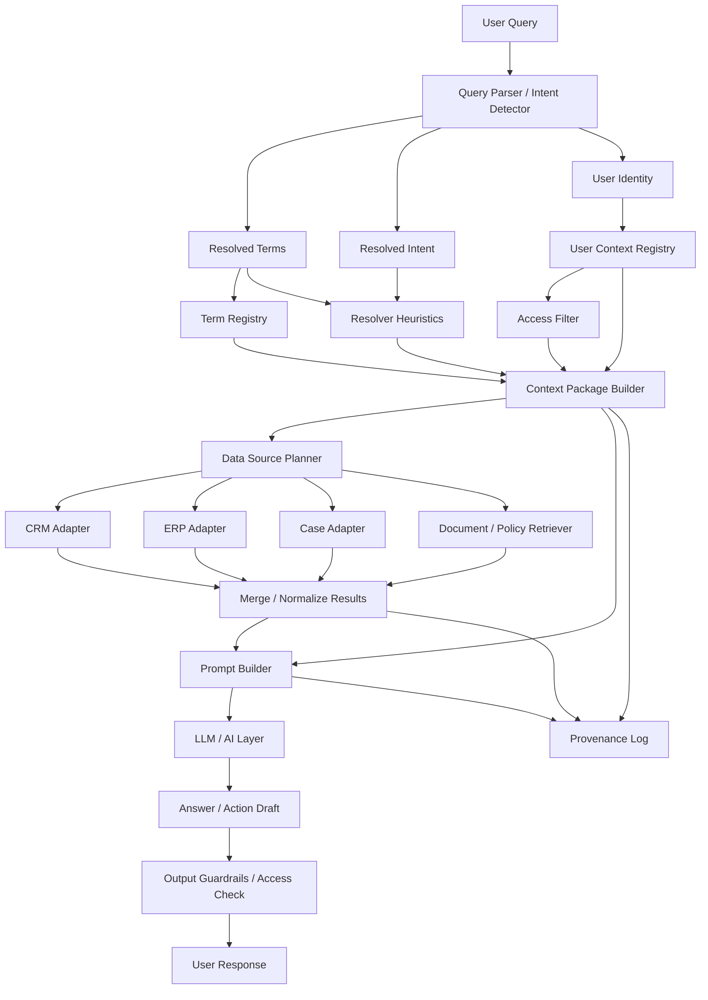

# Context Layer Architecture

## Mermaid Flowchart

## Layer Summary

1. **Query Parser / Intent Detector**
   - Extracts intent, time windows, and candidate terms from natural language.
2. **Term Registry**
   - Stores definitions like Customer, Case, lifecycle rules, source authority, and cross-domain notes.
3. **User Context Registry**
   - Stores role, department, access scope, response preferences, and metric lens.
4. **Resolver Heuristics**
   - Determines what context must be injected for a given query pattern.
5. **Context Package Builder**
   - Produces a compact context bundle instead of sending the full registry to the model.
6. **Data Source Planner + Adapters**
   - Selects and queries CRM / ERP / Case / documents using adapters.
7. **Merge / Normalize Results**
   - Produces a single domain result plus provenance.
8. **Prompt Builder**
   - Assembles a deterministic LLM prompt from query + context + data.
9. **Guardrails**
   - Prevents leaking restricted domains and enforces access.

## Current PoC Files

- `tools/context_resolver.py`
- `tools/context_pipeline.py`
- `tools/prompt_builder.py`
- `tools/adapters/base.py`
- `tools/adapters/mock_crm.py`
- `tools/adapters/mock_erp.py`
- `tools/adapters/mock_case.py`
- `tools/context_data/terms/customer.json`
- `tools/context_data/terms/case.json`
- `tools/context_data/users/sales_manager_demo.json`
- `tools/context_data/resolver_heuristics.json`
- `tests/test_context_resolver.py`
