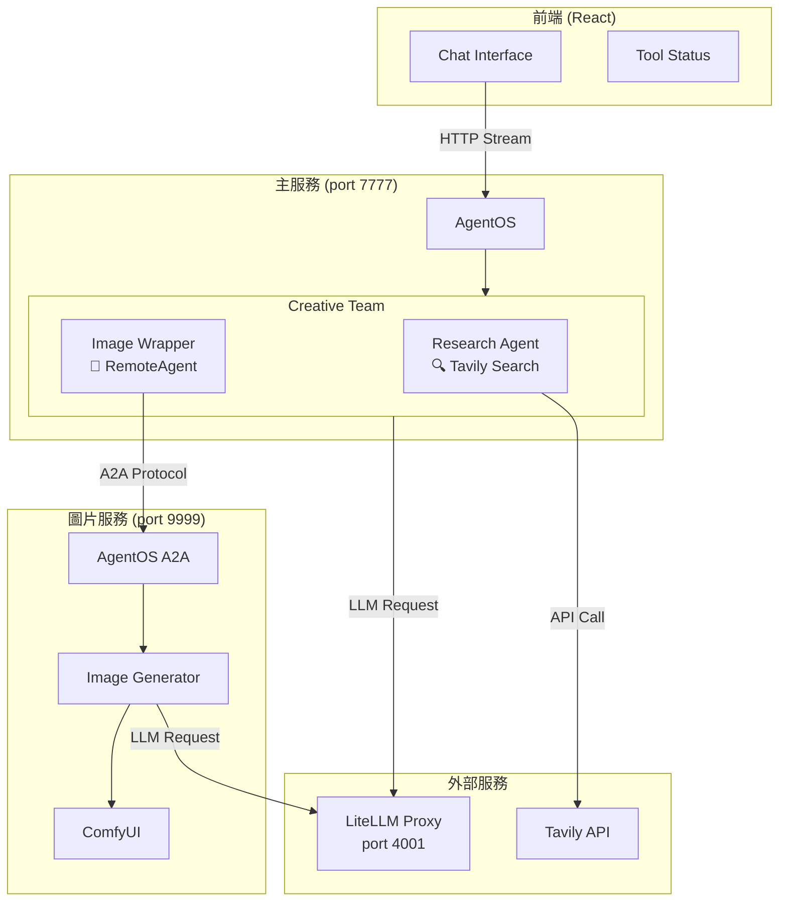
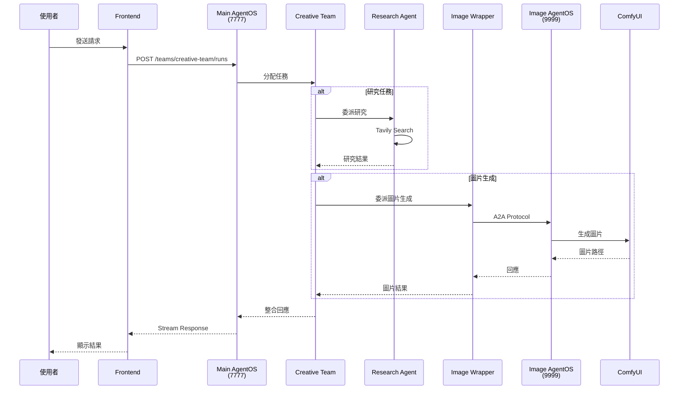

# My Agent App

基於 **Agno 框架**的 AI Agent 應用，整合 AgentOS、Team 協作、RemoteAgent 遠端呼叫，並提供現代化 Web 前端介面。

---

## 目錄

- [技術棧](#技術棧)
- [專案架構](#專案架構)
- [核心功能](#核心功能)
- [快速開始](#快速開始)
- [Agno 框架使用說明](#agno-框架使用說明)
- [API 端點](#api-端點)
- [部署注意事項](#部署注意事項)
- [已知問題與解決方案](#已知問題與解決方案)

---

## 技術棧

| 類別 | 技術 |
|------|------|
| **AI 框架** | [Agno](https://github.com/agno-agi/agno) 2.3.24+ |
| **LLM 閘道** | LiteLLM Proxy |
| **後端框架** | FastAPI (由 AgentOS 自動提供) |
| **資料庫** | SQLite (Session 記憶) |
| **圖片生成** | ComfyUI |
| **前端框架** | React + Vite |
| **搜尋工具** | Tavily Search API |

---

## 專案架構

### 目錄結構

```
my_agent_app/
├── backend/
│   ├── main.py              # AgentOS 主入口
│   ├── agents.py            # 原始模式 (httpx Tool)
│   ├── agents_wrapper.py    # RemoteAgent Wrapper 模式 ✅
│   ├── image_agent.py       # 獨立圖片生成服務 (port 9999)
│   ├── image.py             # ComfyUI 整合
│   └── outputs/images/      # 生成的圖片
├── frontend/
│   └── src/
│       ├── components/
│       │   ├── ChatInterface.jsx
│       │   ├── Message.jsx
│       │   ├── ToolStatus.jsx   # Agent 任務指派 UI
│       │   └── Sidebar.jsx
│       └── services/
│           └── api.js
├── requirements.txt
└── start.bat
```

### 系統架構圖



### 請求流程



---

## 核心功能

### 1. 多 Agent 協作 (Team)
- **Research Agent**: 使用 Tavily 進行網路搜尋
- **Image Generator**: 透過 RemoteAgent 呼叫遠端圖片生成服務

### 2. Session 記憶
- 對話歷史自動保存
- 跨 Session 持久化 (SQLite)
- 支援多用戶隔離

### 3. 串流回應
- 即時顯示 LLM 輸出
- 工具呼叫狀態即時更新
- Agent 任務指派視覺化

### 4. 圖片服務
- 靜態檔案掛載 (`/images/{filename}`)
- ComfyUI 整合
- 自動保存生成結果

---

## 快速開始

### 前置需求
- Python 3.11+
- Node.js 18+
- LiteLLM Proxy (port 4001)
- ComfyUI (選用，用於圖片生成)

### 1. 安裝依賴

```bash
# 後端
cd backend
pip install -r requirements.txt
# 或使用 uv
uv pip install -r requirements.txt

# 前端
cd frontend
npm install
```

### 2. 啟動服務 (順序重要！)

```bash
# 1️⃣ 先啟動圖片服務 (port 9999)
cd backend
python image_agent.py

# 2️⃣ 再啟動主服務 (port 7777)
python main.py

# 3️⃣ 最後啟動前端 (port 3001)
cd frontend
npm run dev
```

### 3. 存取應用

| 服務 | URL |
|------|-----|
| 前端介面 | http://localhost:3001 |
| 主 API 文檔 | http://localhost:7777/docs |
| 圖片服務文檔 | http://localhost:9999/docs |

---

## Agno 框架使用說明

### AgentOS 基本用法

```python
from agno.os import AgentOS
from agno.agent import Agent
from agno.team import Team

# 建立 AgentOS
agent_os = AgentOS(
    name="My AgentOS",
    agents=[agent1, agent2],
    teams=[team1],
    a2a_interface=True,  # 啟用 A2A 協定
)

# 取得 FastAPI app
app = agent_os.get_app()

# 啟動服務
agent_os.serve(app="main:app", host="0.0.0.0", port=7777)
```

### Team 建立

```python
from agno.team import Team

creative_team = Team(
    id="creative-team",
    name="Creative Team",
    model=model,
    members=[research_agent, image_agent],
    instructions="團隊指令...",
    show_members_responses=True,
)
```

### RemoteAgent 使用 (重要！)

> ⚠️ **已知問題**: `RemoteAgent` 無法直接作為 `Team` 成員

**解決方案**: 使用 Wrapper Agent 包裝

```python
from agno.agent import Agent, RemoteAgent
from agno.tools import tool

# 1. 建立 RemoteAgent
remote_image_agent = RemoteAgent(
    base_url="http://localhost:9999",
    agent_id="image-generator",
)

# 2. 建立 Tool 包裝
@tool(name="generate_image_via_remote")
async def call_remote_image_agent(prompt: str) -> str:
    response = await remote_image_agent.arun(prompt)
    return response.content

# 3. 建立 Wrapper Agent
image_wrapper = Agent(
    id="image-wrapper",
    name="Image Generator",
    tools=[call_remote_image_agent],
)

# 4. 加入 Team
team = Team(members=[research_agent, image_wrapper])
```

### FastAPI 靜態檔案掛載

```python
from fastapi.staticfiles import StaticFiles

app = agent_os.get_app()
app.mount("/images", StaticFiles(directory="outputs/images"), name="images")
```

存取方式: `GET http://localhost:7777/images/{filename}.png`

---

## API 端點

### AgentOS 自動提供的端點

| 端點 | 方法 | 說明 |
|------|------|------|
| `/agents/{agent-id}/runs` | POST | 執行單一 Agent |
| `/teams/{team-id}/runs` | POST | 執行 Team |
| `/sessions` | GET | 列出所有 Session |
| `/sessions/{session-id}` | GET | 取得 Session 詳情 |
| `/docs` | GET | Swagger API 文檔 |

### 自定義端點

| 端點 | 方法 | 說明 |
|------|------|------|
| `/images/{filename}` | GET | 存取生成的圖片 |

### 呼叫範例

```bash
# 執行 Team
curl -X POST http://localhost:7777/teams/creative-team/runs \
  -H "Content-Type: application/x-www-form-urlencoded" \
  -d "message=搜尋 AI 新聞並生成一張圖" \
  -d "stream=true" \
  -d "user_id=user-123"
```

---

## 部署注意事項

### 本地開發 vs 生產環境

| 項目 | 本地開發 | 生產環境 |
|------|----------|----------|
| 主機 | localhost | 0.0.0.0 或具體 IP |
| 前端 | Vite dev server | nginx + build |
| HTTPS | 不需要 | **必須** |
| CORS | 允許 localhost | 限制來源 |
| API Key | 硬編碼 | **環境變數** |

### 生產環境必要修改

#### 1. 環境變數配置

```python
# agents_wrapper.py
import os

model = LiteLLMOpenAI(
    id=os.getenv("MODEL_ID", "deepseek-chat"),
    api_key=os.getenv("LITELLM_API_KEY"),
    base_url=os.getenv("LITELLM_BASE_URL"),
)

tavily_tools = TavilyTools(api_key=os.getenv("TAVILY_API_KEY"))
```

#### 2. CORS 設定

```python
from fastapi.middleware.cors import CORSMiddleware

app.add_middleware(
    CORSMiddleware,
    allow_origins=["https://your-domain.com"],  # 限制來源
    allow_credentials=True,
    allow_methods=["*"],
    allow_headers=["*"],
)
```

#### 3. RemoteAgent URL 配置

```python
remote_image_agent = RemoteAgent(
    base_url=os.getenv("IMAGE_AGENT_URL", "http://localhost:9999"),
    agent_id="image-generator",
)
```

#### 4. 前端打包

```bash
cd frontend
npm run build
# 輸出到 dist/ 目錄
```

#### 5. 自定義路由路徑 (root_path)

當透過反向代理將 AgentOS 掛載到特定路徑（如 `/agentos`）時，需要設定 `root_path` 讓 Swagger 文檔和 OpenAPI schema 正確顯示：

**main.py 設定：**

```python
from agno.os import AgentOS
import uvicorn
import os

# 從環境變數讀取路徑前綴
ROOT_PATH = os.getenv("ROOT_PATH", "")  # 例如: "/agentos"

agent_os = AgentOS(
    name="Creative Research AgentOS",
    agents=[research_agent],
    teams=[creative_team],
    a2a_interface=True,
)

app = agent_os.get_app()

if __name__ == "__main__":
    uvicorn.run(
        app, 
        host="0.0.0.0", 
        port=7777,
        root_path=ROOT_PATH  # 設定根路徑前綴
    )
```

**啟動方式：**

```bash
# Linux / macOS
ROOT_PATH=/agentos python main.py

# Windows PowerShell
$env:ROOT_PATH="/agentos"; python main.py

# Windows CMD
set ROOT_PATH=/agentos && python main.py
```

**效果：**
- API 端點: `http://localhost:7777/teams/creative-team/runs`
- 透過反向代理: `https://your-domain.com/agentos/teams/creative-team/runs`
- Swagger 文檔會自動調整所有路徑前綴

#### 6. nginx 反向代理範例

```nginx
server {
    listen 443 ssl;
    server_name your-domain.com;

    ssl_certificate /path/to/cert.pem;
    ssl_certificate_key /path/to/key.pem;

    # 前端
    location / {
        root /path/to/frontend/dist;
        try_files $uri $uri/ /index.html;
    }

    # AgentOS API (掛載到 /agentos 路徑)
    location /agentos/ {
        proxy_pass http://127.0.0.1:7777/;
        proxy_http_version 1.1;
        proxy_set_header Host $host;
        proxy_set_header X-Real-IP $remote_addr;
        proxy_set_header X-Forwarded-For $proxy_add_x_forwarded_for;
        proxy_set_header X-Forwarded-Proto $scheme;
        proxy_set_header X-Forwarded-Prefix /agentos;
        proxy_set_header Upgrade $http_upgrade;
        proxy_set_header Connection "upgrade";
        proxy_buffering off;  # 重要：支援 SSE 串流
        proxy_read_timeout 300s;  # 長請求超時設定
    }

    # 圖片 (也掛載到 /agentos 路徑下)
    location /agentos/images/ {
        proxy_pass http://127.0.0.1:7777/images/;
    }
}
```

> **注意**: 使用 `root_path` 後，應用本身的路由不會改變，只是讓 OpenAPI 文檔知道前端會加上路徑前綴。實際的路徑轉換由 nginx 完成。

#### 7. 服務管理 (systemd)

```ini
# /etc/systemd/system/agent-main.service
[Unit]
Description=Creative Agent Main Service
After=network.target

[Service]
Type=simple
User=www-data
WorkingDirectory=/path/to/backend
Environment="MODEL_ID=deepseek-chat"
Environment="LITELLM_API_KEY=your-key"
ExecStart=/path/to/venv/bin/python main.py
Restart=always

[Install]
WantedBy=multi-user.target
```

---

## 已知問題與解決方案

### 1. RemoteAgent 無法直接作為 Team 成員

**錯誤訊息**:
```
AttributeError: 'RemoteAgent' object has no attribute 'knowledge_filters'
```

**原因**: Agno 2.3.24 的 `RemoteAgent` 缺少 `Team` 所需的屬性

**解決方案**: 使用 Wrapper Agent 模式 (參見 `agents_wrapper.py`)

### 2. Async Tool 必須使用 aprint_response

**錯誤訊息**:
```
Async function can't be used with synchronous agent.run()
```

**解決方案**: 使用 `await team.aprint_response()` 或 `await team.arun()`

### 3. 圖片路徑格式

**注意**: Windows 和 Linux 路徑格式不同
- Windows: `outputs/images\z-image_00001_.png`
- Linux: `outputs/images/z-image_00001_.png`

前端應處理兩種格式。

---

## 授權

MIT License

---

## 參考資源

- [Agno 官方文檔](https://docs.agno.com/)
- [Agno GitHub](https://github.com/agno-agi/agno)
- [LiteLLM 文檔](https://docs.litellm.ai/)
- [Tavily API](https://tavily.com/)
